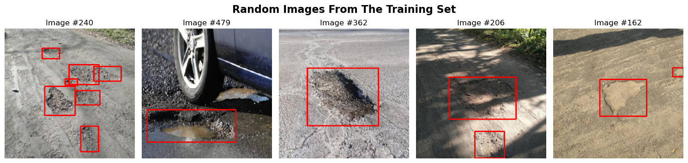
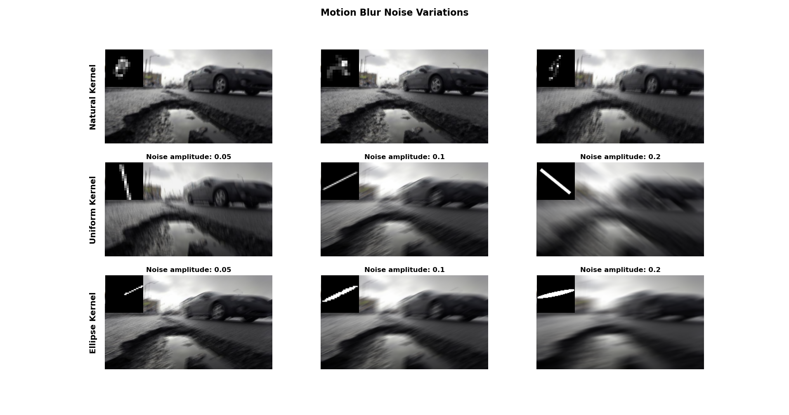
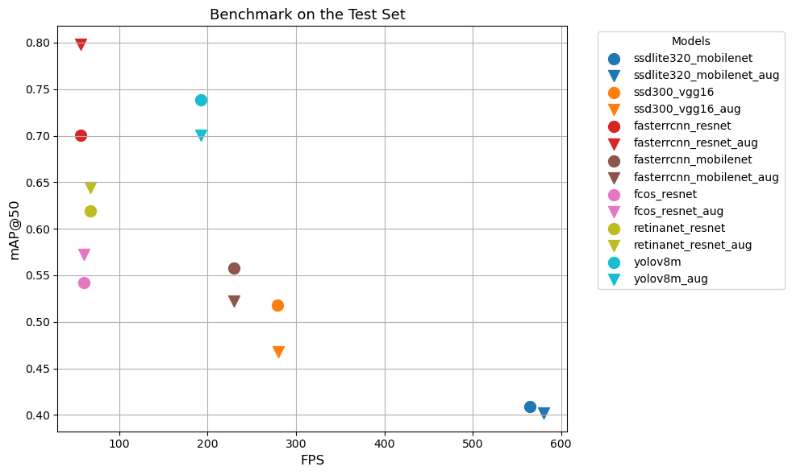
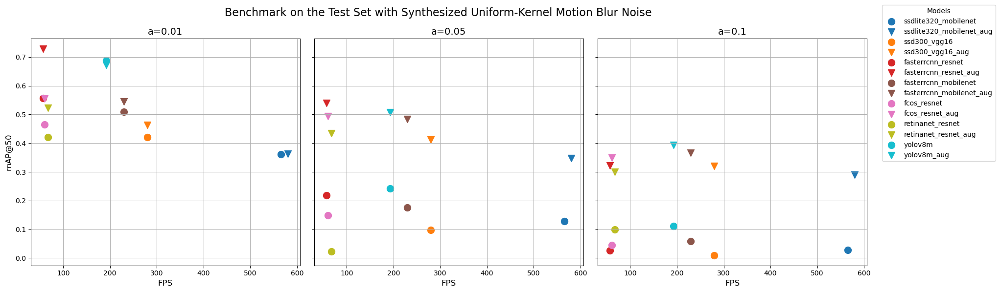
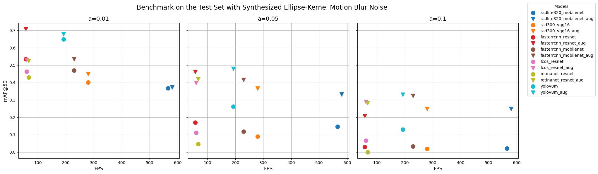
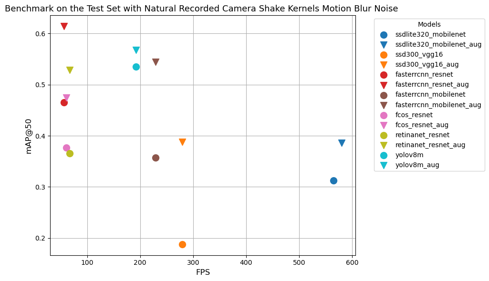
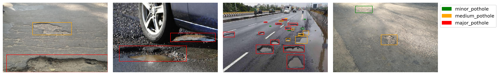
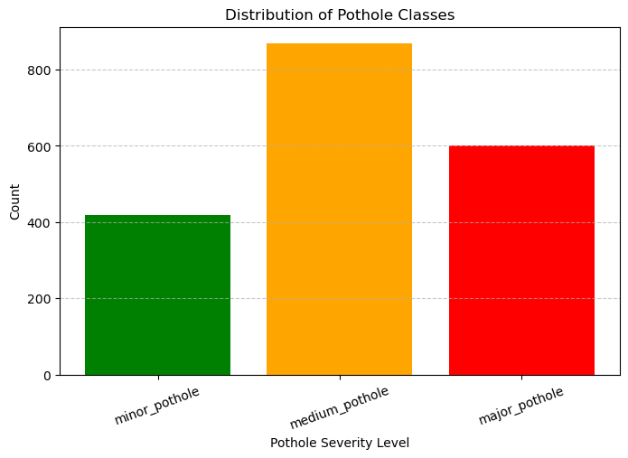

# <h1 align="center">ECE 046211 - Technion - Deep Learning - Project </h1> 
## <h2 align="center"> "Mind the Gap" - A Deep Learning Analysis of Pothole Detection </h2>

<h4 align="center">
  <table align="center" style="border: none;">
    <tr style="border: none;">
      <td align="center" style="border: none;">
        <div>
           <br>
          <strong>Itai Benyamin</strong> <br>
          <a href="https://www.linkedin.com/in/itai-benyamin/">
            
          </a>
          <a href="https://github.com/Itai-b">
            
          </a>
        </div>
      </td>
      <td align="center" style="border: none;">
        <div>
           <br>
          <strong>Idan Baruch</strong> <br>
          <a href="https://www.linkedin.com/in/idan-baruch-76490a181/">
            
          </a>
          <a href="https://github.com/idanbaru">
            
          </a>
        </div>
      </td>
    </tr>
    <tr style="border: none;">
      <td colspan="2" align="center" style="border: none">
        <a href="https://youtu.be/Lghsg8BiNpw" target="_blank">
          
        </a>
      </td>
    </tr>
  </table>
</h4>

## Abstract
In this project we trained different state-of-the-art (SOTA) object detection models for the task of pothole detection and evaluated their performance under  self-synthesized motion blur noise. This noise was generated using randomized kernel types and sizes to simulate real-world conditions where camera shake or motion artifacts may degrade image quality. The study provides insights into how motion blur affects detection accuracy and offers recommendations for improving the robustness of automated road maintenance systems.

Moreover, we created our own dataset where we classified the potholes into three severity levels: `low`, `medium`, and `high`. This classification was based on how dangerous a pothole is to cars and pedestrians, which can help prioritize road maintenance efforts and allocate resources more effectively. The dataset was annotated with bounding boxes and severity labels, enabling the models to learn to detect and classify potholes simultaneously.

<div align="center">
  
</div>

## Table of Contents
* [Files in the repository](#Files-in-the-repository)
* [Installation Instructions](#Installation-Instructions)
  * [Libraries to Install](#Libraries-to-Install)
* [How to Use](#How-to-Use)
* [Dataset](#Dataset)
* [Object Detection Models](#Object-Detection-Models)
  * [Hyperparameter Tuning](#Hyperparameter-Tuning)
* [Training Results](#Training-Results)
* [Motion Blur Noise](#Motion-Blur-Noise)
* [Data Augmentations](#Data-Augmentations)
* [Post Augmentations Results](#Post-Augmentations-Results)
* [Potholes Severity](#Potholes-Severity)
* [References](#References)

## Files in the repository

| File Name                       | Purpose                                                                 |
|---------------------------------|-------------------------------------------------------------------------|
| `data_process.py`               | Handles data preprocessing, such as loading and transforming datasets.  |
| `trainer.py`                    | Manages the training process for torchvision models.                    |
| `evaluator.py`                  | Evaluates the performance of trained models using metrics.              |
| `motion_blur.py`                | Applies our self synthesized motion blur effects to images for testing. |
| `utils.py`                      | Contains utility functions used across different modules.               |
| `torchvision_models_train.ipynb`| Jupyter notebook for training models using torchvision.                 |
| `models_data.json`              | Stores metadata for the models results                                  |
| `main.ipynb`                    | Main notebook for orchestrating the project workflow.                   |
| `models_evaluation_with_noise`   | Directory containing notebooks for training and evaluating models with motion blur noise. |
| `models_evaluation_with_severity_levels.ipnb` | Notebook for evaluating models with pothole severity levels.       |
| `video_inference.ipynb` | Notebook for running inference on a video using the best models. | 
| `config`                        | Directory containing environment configuration files.                   |
| `data`                          | Directory containing all the datasets and results                       |
| `HW`                            | Directory for our homework assigments.                                  |

## Installation Instructions

1. Get Anaconda with Python 3, follow the instructions according to your OS (Windows/Mac/Linux) at [link](https://www.anaconda.com/download)
2. Install the basic packages using the provided `environment.yml` file by running: `conda env create -f config/environment.yml` which will create a new conda environment named `deep_learn`. You can use `config/environment_no_cuda.yml` for an environment that uses pytorch cpu version.
3. Alternatively, you can create a new environment and install packages from scratch:
In Windows open `Anaconda Prompt` from the start menu, in Mac/Linux open the terminal and run `conda create --name deep_learn`. Full guide at [link](https://docs.conda.io/projects/conda/en/latest/user-guide/tasks/manage-environments.html#creating-an-environment-with-commands)
4. To activate the environment, open the terminal (or `Anaconda Prompt` in Windows) and run `conda activate deep_learn`
5. Install the required libraries according to the table below (to search for a specific library and the corresponding command you can also look at [link](https://anaconda.org/))

### Libraries to Install

|Library           | Command to Run |
|------------------|-----------------------------------------|
|`Jupyter Notebook`|  `conda install -c conda-forge notebook`|
|`numpy`           |  `conda install -c conda-forge numpy`|
|`matplotlib`      |  `conda install -c conda-forge matplotlib`|
|`pandas`          |  `conda install -c conda-forge pandas`|
|`scipy`           | `conda install -c anaconda scipy `|
|`scikit-learn`    |  `conda install -c conda-forge scikit-learn`|
|`seaborn`         |  `conda install -c conda-forge seaborn`|
|`tqdm`            | `conda install -c conda-forge tqdm`|
|`opencv`          | `conda install -c conda-forge opencv`|
|`optuna`          | `pip install optuna`|
|`optuna-dashboard`| `pip install optuna-dashboard`|
|`kagglehub`       | `pip install kagglehub` |
|`kornia`          | `pip install kornia` |
|`xmltodict`       | `pip install xmltodict`|
|`torchmetrics`    | `pip install torchmetrics` |
|`ipywidgets`      | `pip install ipywidgets`|
|`ultralytics`     | `conda install -c conda-forge ultralytics`|
|`pytorch` (cpu)   | `conda install pytorch torchvision cpuonly -c pytorch` (<a href="https://pytorch.org/get-started/locally/">get command from PyTorch.org</a>)|
|`pytorch` (gpu)   | `conda install pytorch torchvision pytorch-cuda=11.8 -c pytorch -c nvidia` (<a href="https://pytorch.org/get-started/locally/">get command from PyTorch.org</a>)|

## How to Use
After installing the required libraries, you can run the `main.ipynb` notebook to follow through with the project results and anlysis.

If you wish to train the models and evaluate them your self you can run the notebooks under `models_evaluation_with_noise` which contain the training and evaluation process for the all the models we analysed with the motion blur noise.

You can also download our weights from the following link:
- [Google Drive](https://drive.google.com/drive/folders/1Zj22MpCoxBWR9_azWvHRTWe_qfoa9Fsj?usp=drive_link)
  
  Just download the `models.zip` file and replace it with the existing `./data/models` folder in the repository.

The optuna hyperparameters tuning can be run using the `torchvision_models_train.ipynb` notebook. The results of the hyperparameters tuning can be viewed using the optuna dashboard (see below).

You can check the pothole severity classification we added to the dataset in the `models_evaluation_with_severity_levels.ipynb` notebook.

## Dataset
We used the following dataset from kaggle [chitholian_annotated_potholes_dataset](https://www.kaggle.com/datasets/chitholian/annotated-potholes-dataset)

The Dataset contains 665 images of potholes on roads with corresponding annotations boxes for each pothole.

We created a custom torch dataset named PotholeDetectionDataset and then split them to seperate train, validation and test sets (70-10-20).

<div align="center">
  
</div>

## Object Detection Models
In this project we trained the following SOTA object detection models:

[torchvision models](https://pytorch.org/vision/stable/models.html#object-detection-instance-segmentation-and-person-keypoint-detection):
- `ssd` [SSD: Single Shot MultiBox Detector](http://dx.doi.org/10.1007/978-3-319-46448-0_2)
- `faster rcnn` [Faster R-CNN: Towards Real-Time Object Detection with Region Proposal Networks](https://arxiv.org/abs/1506.01497)
- `retinanet` [Focal Loss for Dense Object Detection](https://arxiv.org/abs/1708.02002)
- `fcos` [FCOS: Fully Convolutional One-Stage Object Detection](https://arxiv.org/abs/1904.01355)

[ultralytics yolo](https://docs.ultralytics.com/models/yolov8/):
- `yolov8m` [YOLOv8 models documentation](https://docs.ultralytics.com/models/yolov8/)

### Hyperparameter Tuning
In this project, hyperparameter tuning was conducted using Optuna to optimize training on various torchvision models.
A comprehensive search was performed across multiple hyperparameter spaces, including model preweight strategies, optimizer types, learning rates, momentum, and weight decay parameters.
The study involved carefully selecting combinations of hyperparameters to achieve the best validation mean average precision (mAP).
The objective function was optimized using `MedianPruner` and `TPESampler` for better exploration and exploitation across trials. Below is a detailed table of the tuned hyperparameters.

| **Category** | **Hyperparameter** | **Range/Choices**                  | **Description**                          |
|--------------|--------------------|--------------------------------------|--------------------------------------------|
| Model        | `preweight_mode`   | `['random', 'freezing', 'fine_tuning']` | Strategy for loading model weights      |
| Training     | `batch_size`       | `[4, 8]`                            | Number of samples per training batch      |
| Training     | `epochs`           | `[10, 20]`                          | Number of training epochs                 |
| Optimizer    | `optimizer`        | `['SGD', 'Adam', 'AdamW', 'RMSprop']` | Optimization algorithm                   |
| SGD          | `lr`               | `[5e-3, 5e-2]` (log scale)          | Learning rate for SGD                     |
| SGD          | `momentum`         | `[0.9, 0.99]`                       | Momentum for SGD                          |
| SGD          | `weight_decay`     | `[1e-5, 1e-3]` (log scale)          | Weight decay for SGD                      |
| Adam/AdamW   | `lr`               | `[1e-4, 1e-2]` (log scale)          | Learning rate for Adam/AdamW              |
| Adam/AdamW   | `beta1`            | `[0.8, 0.999]`                      | Beta1 parameter                           |
| Adam/AdamW   | `beta2`            | `[0.9, 0.999]`                      | Beta2 parameter                           |
| RMSprop      | `lr`               | `[1e-3, 1e-2]` (log scale)          | Learning rate for RMSprop                 |
| RMSprop      | `momentum`         | `[0.9, 0.99]`                       | Momentum for RMSprop                      |
| RMSprop      | `weight_decay`     | `[1e-1, 1]` (log scale)             | Weight decay for RMSprop                  |
| Scheduler    | `scheduler`        | `['StepLR', 'CosineAnnealingLR', 'ReduceLROnPlateau', 'OneCycleLR']` | Learning rate scheduler type |
| StepLR       | `step_size`        | `[2, 5]`                            | Step size for StepLR                      |
| StepLR       | `gamma`            | `[0.05, 0.5]`                       | Decay factor for StepLR                   |
| CosineAnneal | `T_max`            | `[5, 15]`                           | Maximum cycle length for CosineAnnealingLR|
| CosineAnneal | `eta_min`          | `[1e-7, 1e-5]` (log scale)          | Minimum learning rate                     |
| Plateau      | `factor`           | `[0.1, 0.5]`                        | Decay factor for ReduceLROnPlateau        |
| Plateau      | `patience`         | `[2, 5]`                            | Patience for ReduceLROnPlateau            |
| OneCycleLR   | `max_lr`           | `[1e-4, 1e-2]` (log scale)          | Maximum learning rate for OneCycleLR      |

- The best configurations for each model was saved for future training (i.e. `data/models/fasterrcnn_resnet50_fpn/fasterrcnn_resnet50_fpn_best_params.json`)
- Results available in Optuna dashboard at `./data/models/db.sqlite3`
  - launch it using:
  ```
  optuna-dashboard ./data/models/db.sqlite3
  ```
  - then open your browser at `http://localhost:8080`
- At the end, each configuration was set to be trained with a batch size of 8 for 100 epochs.
- Best weights achieving the highest mAP@50 on the validation set were saved.

## Training Results

<div align="center">
  
</div>

## Motion Blur Noise

<div align="center">
  
</div>

## Data Augmentations
To cope with the motion blur noise, we applied the following data augmentations using [kornia](https://kornia.readthedocs.io/en/latest/):

| **Augmentation**       | **Parameters**                                                                 | **Description**                                                                 |
|------------------------|---------------------------------------------------------------------------------|---------------------------------------------------------------------------------|
| `RandomMotionBlur`     | `kernel_size=(3, 51)`, `angle=(-180.0, 180.0)`, `direction=(-1.0, 1.0)`, `p=0.4` | Apply random motion blur.                                                      |
| `RandomGaussianBlur`   | `kernel_size=(3, 3)`, `sigma=(0.1, 2.0)`, `p=0.3`                               | Apply random Gaussian blur to simulate out-of-focus blur.                      |
| `RandomSharpness`      | `sharpness=(0.5, 2.0)`, `p=0.3`                                                 | Adjust the sharpness of the image to simulate varying levels of focus.         |
| `ColorJiggle`          | `brightness=0.2`, `contrast=0.2`, `saturation=0.2`, `p=0.2`                      | Apply a random transformation to the brightness, contrast, saturation, and hue.|

These augmentations were chosen to help the model generalize better to different types of blur that might be encountered in real-world scenarios.

## Post Augmentations Results

### Results on the Clean Test Set

<div align="center">
  
</div>

### Results on the Test Set Test Set with Uniform Motion Blur

<div align="center">
  
</div>

### Results on the Test Set with Ellipse Motion Blur

<div align="center">
  
</div>

### Results on the Test Set with Natural Motion Blur

<div align="center">
  
</div>

## Potholes Severity

<div align="center">
  
</div>

<div align="center">
  
</div>


## References

1. Z. Zou, K. Chen, Z. Shi, Y. Guo, and J. Ye. *Object Detection in 20 Years: A Survey*. Proceedings of the IEEE, vol. 111, no. 3, pp. 257-276, March 2023. DOI: [10.1109/JPROC.2023.3238524](https://doi.org/10.1109/JPROC.2023.3238524).

2. *Object Detection on COCO*. Papers with Code. [Link](https://paperswithcode.com/sota/object-detection-on-coco).

3. *Object Detection Leaderboard*. Hugging Face. [Link](https://huggingface.co/blog/object-detection-leaderboard).

4. *Faster R-CNN vs YOLO vs SSD: Object Detection Algorithms*. Medium, IBM Data & AI. [Link](https://medium.com/ibm-data-ai/faster-r-cnn-vs-yolo-vs-ssd-object-detection-algorithms-18badb0e02dc).

5. W. Liu, D. Anguelov, D. Erhan, C. Szegedy, S. Reed, C.-Y. Fu, and A. C. Berg. *SSD: Single Shot MultiBox Detector*. In Computer Vision – ECCV 2016, Springer International Publishing, 2016, pp. 21–37. DOI: [10.1007/978-3-319-46448-0_2](http://dx.doi.org/10.1007/978-3-319-46448-0_2).

6. S. Ren, K. He, R. Girshick, and J. Sun. *Faster R-CNN: Towards Real-Time Object Detection with Region Proposal Networks*. arXiv preprint arXiv:1506.01497, 2016. [Link](https://arxiv.org/abs/1506.01497).

7. T.-Y. Lin, P. Goyal, R. Girshick, K. He, and P. Dollár. *Focal Loss for Dense Object Detection*. arXiv preprint arXiv:1708.02002, 2018. [Link](https://arxiv.org/abs/1708.02002).

8. Z. Tian, C. Shen, H. Chen, and T. He. *FCOS: Fully Convolutional One-Stage Object Detection*. arXiv preprint arXiv:1904.01355, 2019. [Link](https://arxiv.org/abs/1904.01355).

9. Ultralytics. *YOLOv8 models documentation*. [Link](https://docs.ultralytics.com/models/yolov8/).

10. T. Tamagusko and A. Ferreira. *Optimizing Pothole Detection in Pavements: A Comparative Analysis of Deep Learning Models*. Eng. Proc. 2023, 36, 11. DOI: [10.3390/engproc2023036011](https://doi.org/10.3390/engproc2023036011).

11. A. Levin, Y. Weiss, F. Durand, and W. T. Freeman. *Understanding and Evaluating Blind Deconvolution Algorithms*. 2009 IEEE Conference on Computer Vision and Pattern Recognition, Miami, FL, USA, 2009, pp. 1964-1971. DOI: [10.1109/CVPR.2009.5206815](https://doi.org/10.1109/CVPR.2009.5206815).

12. A. Rahman and S. Patel. *Annotated Potholes Image Dataset*. Kaggle, 2020. DOI: [10.34740/KAGGLE/DSV/973710](https://www.kaggle.com/dsv/973710).